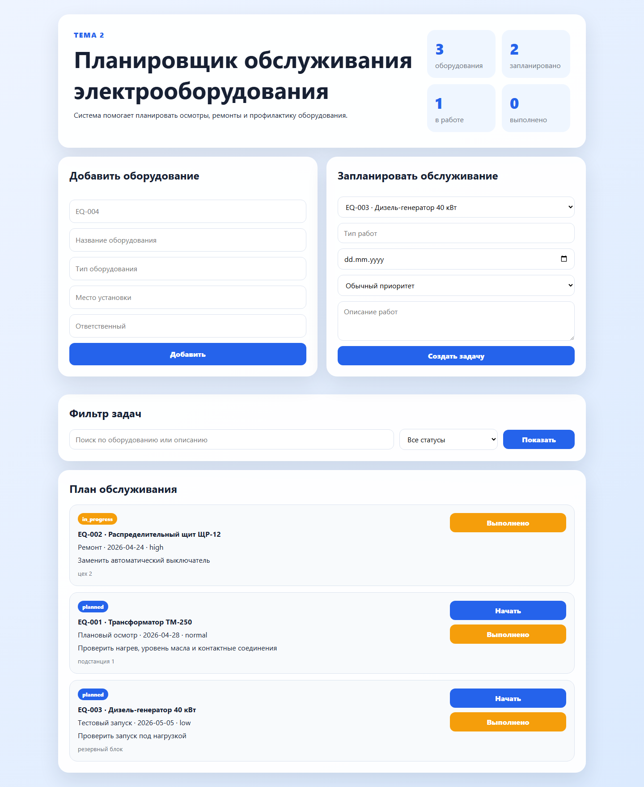

# Дополнение к практической работе. Задания 2-4

Тема 2: Планировщик обслуживания электрооборудования.

Проект представляет собой веб-приложение для планирования технического обслуживания электрооборудования: добавления оборудования, создания задач обслуживания и контроля выполнения работ.

## Задание 2 - Серверная часть

Серверная часть реализована на Python и Flask. Сервер принимает HTTP-запросы от клиента, вызывает функции database.py, сохраняет данные в SQLite и возвращает HTML-страницы или JSON.

### Структура серверной части

```text
electrical-maintenance-planner-app/
|-- app.py
|-- database.py
|-- maintenance.db
|-- schema.sql
|-- templates/index.html
`-- static/styles.css
```

```text
Браузер -> app.py -> database.py -> maintenance.db
Браузер <- HTML/JSON <- app.py
```

### Основные функции сервера

| Функция/маршрут | Параметры | Что делает | Что возвращает |
|---|---|---|---|
| `index(), GET /` | status, search | Получает задачи обслуживания, оборудование и статистику. | HTML-страница. |
| `create_equipment(), POST /equipment` | inventory_number, name, equipment_type, location, responsible | Добавляет новое оборудование. | Redirect на /. |
| `create_task(), POST /tasks` | equipment_id, task_type, planned_date, priority, description | Создаёт задачу обслуживания. | Redirect на /. |
| `start(task_id), POST /tasks/<id>/start` | task_id | Переводит задачу в работу. | Redirect на /. |
| `complete(task_id), POST /tasks/<id>/complete` | task_id | Отмечает задачу выполненной. | Redirect на /. |
| `api_tasks(), GET /api/tasks` | status, search | Возвращает задачи обслуживания. | JSON. |

### Примеры запросов и ответов сервера

```http
GET /api/tasks?status=planned
```

```json
{
  "count": 2,
  "items": [
    {
      "id": 1,
      "inventory_number": "EQ-001",
      "name": "Трансформатор ТМ-250",
      "task_type": "Плановый осмотр",
      "planned_date": "2026-04-28",
      "priority": "normal",
      "status": "planned"
    }
  ]
}
```

## Задание 3 - Клиентская часть

Клиентская часть состоит из одной HTML-страницы и CSS-файла. Пользователь видит статистику, формы добавления оборудования и задач, фильтр и список работ.

### Скриншот главной страницы



### Основные экраны и блоки

| Блок страницы | Назначение |
|---|---|
| Статистика | Показывает количество оборудования и задач по статусам. |
| Форма оборудования | Добавляет новое электрооборудование. |
| Форма обслуживания | Создаёт задачу планового ремонта или осмотра. |
| Фильтр | Фильтрует задачи по статусу и поисковой строке. |
| План обслуживания | Показывает задачи и кнопки смены статуса. |

### Схема навигации

```text
Главная / -> POST /equipment -> /
Главная / -> POST /tasks -> /
Главная / -> POST /tasks/<id>/start -> /
Главная / -> POST /tasks/<id>/complete -> /
```

### Работа кнопок и форм

- Добавить сохраняет оборудование.
- Создать задачу добавляет план обслуживания.
- Показать применяет фильтры.
- Начать переводит задачу в статус in_progress.
- Выполнено закрывает задачу обслуживания.

### Запросы клиента к серверу

| Действие пользователя | HTTP-запрос | Данные |
|---|---|---|
| Открыть страницу | `GET /` | Нет или параметры фильтра. |
| Добавить оборудование | `POST /equipment` | Данные формы оборудования. |
| Создать задачу | `POST /tasks` | Данные формы обслуживания. |
| Начать задачу | `POST /tasks/1/start` | id задачи в URL. |
| Закрыть задачу | `POST /tasks/1/complete` | id задачи в URL. |
| Получить JSON | `GET /api/tasks` | status, search. |

### Пользовательский сценарий

1. Пользователь открывает главную страницу.
2. Добавляет новое оборудование с инвентарным номером.
3. Создаёт задачу обслуживания и выбирает дату.
4. Фильтрует список по статусу planned.
5. Нажимает Начать, когда работа началась.
6. После выполнения нажимает Выполнено.

## Задание 4 - Базы данных

В SQLite-базе maintenance.db хранятся таблицы оборудования и задач обслуживания.

### Структура базы данных

```text
equipment (1) -> (many) maintenance_tasks
```

### Таблица equipment

| Поле | Тип | Описание |
|---|---|---|
| `id` | INTEGER | Первичный ключ. |
| `inventory_number` | TEXT | Уникальный инвентарный номер. |
| `name` | TEXT | Название оборудования. |
| `equipment_type` | TEXT | Тип оборудования. |
| `location` | TEXT | Место установки. |
| `responsible` | TEXT | Ответственный сотрудник. |
| `status` | TEXT | active, service или stopped. |
| `created_at` | TEXT | Дата создания записи. |
### Таблица maintenance_tasks

| Поле | Тип | Описание |
|---|---|---|
| `id` | INTEGER | Первичный ключ. |
| `equipment_id` | INTEGER | Внешний ключ на equipment.id. |
| `task_type` | TEXT | Тип обслуживания. |
| `planned_date` | TEXT | Плановая дата. |
| `priority` | TEXT | low, normal или high. |
| `description` | TEXT | Описание работ. |
| `status` | TEXT | planned, in_progress или done. |
| `completed_at` | TEXT | Дата выполнения. |

### Примеры SQL-запросов

```sql
SELECT * FROM equipment;
```

```sql
SELECT * FROM maintenance_tasks WHERE status = 'planned';
```

```sql
INSERT INTO equipment (inventory_number, name, equipment_type, location, responsible) VALUES ('EQ-004', 'Компрессор', 'двигатель', 'цех 1', 'Кузнецов К.К.');
```

```sql
SELECT equipment.name, maintenance_tasks.task_type FROM maintenance_tasks JOIN equipment ON equipment.id = maintenance_tasks.equipment_id;
```

### Примеры данных в базе

| id | Инв. номер | Оборудование | Задача | Дата | Статус |
|---|---|---|---|---|---|
| 1 | EQ-001 | Трансформатор ТМ-250 | Плановый осмотр | 2026-04-28 | planned |
| 2 | EQ-002 | Распределительный щит ЩР-12 | Ремонт | 2026-04-24 | in_progress |

## Вывод

В проекте описаны серверная часть, клиентский интерфейс и база данных планировщика обслуживания электрооборудования. Система позволяет фиксировать оборудование и контролировать выполнение технических работ.
